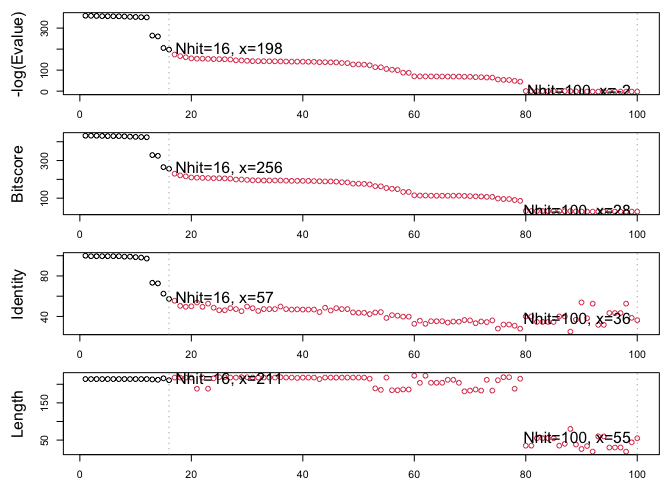

Class 09
================

``` r
read.csv("Data Export Summary.csv")
```

    ##            Molecular.Type  X.ray   NMR   EM Multiple.methods Neutron Other
    ## 1          Protein (only) 144616 11881 6759              185      70    32
    ## 2 Protein/Oligosaccharide   8551    31 1133                5       0     0
    ## 3              Protein/NA   7623   274 2183                3       0     0
    ## 4     Nucleic acid (only)   2396  1399   61                8       2     1
    ## 5                   Other    154    31    3                0       0     0
    ## 6  Oligosaccharide (only)     11     6    0                1       0     4
    ##    Total
    ## 1 163543
    ## 2   9720
    ## 3  10083
    ## 4   3867
    ## 5    188
    ## 6     22

``` r
163351/187423 * 100
```

    ## [1] 87.15633

``` r
10139/187423 * 100
```

    ## [1] 5.409688

> Q1: 87.15633% Q2: 5.409688% Q3. 3819 Q4. The 2 hydrogen atoms show up
> as charges.

``` r
library(bio3d)
pdb <- read.pdb("1hsg")
```

    ##   Note: Accessing on-line PDB file

> Q10. msa Q11. devtools Q12. TRUE

``` r
library(bio3d)
aa <- get.seq("1ake_A")
```

    ## Warning in get.seq("1ake_A"): Removing existing file: seqs.fasta

    ## Fetching... Please wait. Done.

> Q13. 214

``` r
b <- blast.pdb(aa)
```

    ##  Searching ... please wait (updates every 5 seconds) RID = 1DNXTCGR013 
    ##  ..........................................................
    ##  Reporting 100 hits

``` r
hits <- plot(b)
```

    ##   * Possible cutoff values:    197 -3 
    ##             Yielding Nhits:    16 100 
    ## 
    ##   * Chosen cutoff value of:    197 
    ##             Yielding Nhits:    16

<!-- -->

``` r
head(hits$pdb.id)
```

    ## [1] "1AKE_A" "4X8M_A" "6S36_A" "6RZE_A" "4X8H_A" "3HPR_A"

``` r
hits <- NULL
hits$pdb.id <- c('1AKE_A','6S36_A','6RZE_A','3HPR_A','1E4V_A','5EJE_A','1E4Y_A','3X2S_A','6HAP_A','6HAM_A','4K46_A','3GMT_A','4PZL_A')
```

``` r
files <- get.pdb(hits$pdb.id, path="pdbs", split=TRUE, gzip=TRUE)
```

    ## Warning in get.pdb(hits$pdb.id, path = "pdbs", split = TRUE, gzip = TRUE): pdbs/
    ## 1AKE.pdb.gz exists. Skipping download

    ## Warning in get.pdb(hits$pdb.id, path = "pdbs", split = TRUE, gzip = TRUE): pdbs/
    ## 6S36.pdb.gz exists. Skipping download

    ## Warning in get.pdb(hits$pdb.id, path = "pdbs", split = TRUE, gzip = TRUE): pdbs/
    ## 6RZE.pdb.gz exists. Skipping download

    ## Warning in get.pdb(hits$pdb.id, path = "pdbs", split = TRUE, gzip = TRUE): pdbs/
    ## 3HPR.pdb.gz exists. Skipping download

    ## Warning in get.pdb(hits$pdb.id, path = "pdbs", split = TRUE, gzip = TRUE): pdbs/
    ## 1E4V.pdb.gz exists. Skipping download

    ## Warning in get.pdb(hits$pdb.id, path = "pdbs", split = TRUE, gzip = TRUE): pdbs/
    ## 5EJE.pdb.gz exists. Skipping download

    ## Warning in get.pdb(hits$pdb.id, path = "pdbs", split = TRUE, gzip = TRUE): pdbs/
    ## 1E4Y.pdb.gz exists. Skipping download

    ## Warning in get.pdb(hits$pdb.id, path = "pdbs", split = TRUE, gzip = TRUE): pdbs/
    ## 3X2S.pdb.gz exists. Skipping download

    ## Warning in get.pdb(hits$pdb.id, path = "pdbs", split = TRUE, gzip = TRUE): pdbs/
    ## 6HAP.pdb.gz exists. Skipping download

    ## Warning in get.pdb(hits$pdb.id, path = "pdbs", split = TRUE, gzip = TRUE): pdbs/
    ## 6HAM.pdb.gz exists. Skipping download

    ## Warning in get.pdb(hits$pdb.id, path = "pdbs", split = TRUE, gzip = TRUE): pdbs/
    ## 4K46.pdb.gz exists. Skipping download

    ## Warning in get.pdb(hits$pdb.id, path = "pdbs", split = TRUE, gzip = TRUE): pdbs/
    ## 3GMT.pdb.gz exists. Skipping download

    ## Warning in get.pdb(hits$pdb.id, path = "pdbs", split = TRUE, gzip = TRUE): pdbs/
    ## 4PZL.pdb.gz exists. Skipping download

    ##   |                                                                              |                                                                      |   0%  |                                                                              |=====                                                                 |   8%  |                                                                              |===========                                                           |  15%  |                                                                              |================                                                      |  23%  |                                                                              |======================                                                |  31%  |                                                                              |===========================                                           |  38%  |                                                                              |================================                                      |  46%  |                                                                              |======================================                                |  54%  |                                                                              |===========================================                           |  62%  |                                                                              |================================================                      |  69%  |                                                                              |======================================================                |  77%  |                                                                              |===========================================================           |  85%  |                                                                              |=================================================================     |  92%  |                                                                              |======================================================================| 100%

``` r
library(muscle)
```

    ## Loading required package: Biostrings

    ## Loading required package: BiocGenerics

    ## 
    ## Attaching package: 'BiocGenerics'

    ## The following objects are masked from 'package:stats':
    ## 
    ##     IQR, mad, sd, var, xtabs

    ## The following objects are masked from 'package:base':
    ## 
    ##     anyDuplicated, append, as.data.frame, basename, cbind, colnames,
    ##     dirname, do.call, duplicated, eval, evalq, Filter, Find, get, grep,
    ##     grepl, intersect, is.unsorted, lapply, Map, mapply, match, mget,
    ##     order, paste, pmax, pmax.int, pmin, pmin.int, Position, rank,
    ##     rbind, Reduce, rownames, sapply, setdiff, sort, table, tapply,
    ##     union, unique, unsplit, which.max, which.min

    ## Loading required package: S4Vectors

    ## Loading required package: stats4

    ## 
    ## Attaching package: 'S4Vectors'

    ## The following objects are masked from 'package:base':
    ## 
    ##     expand.grid, I, unname

    ## Loading required package: IRanges

    ## 
    ## Attaching package: 'IRanges'

    ## The following object is masked from 'package:bio3d':
    ## 
    ##     trim

    ## Loading required package: XVector

    ## Loading required package: GenomeInfoDb

    ## 
    ## Attaching package: 'Biostrings'

    ## The following object is masked from 'package:bio3d':
    ## 
    ##     mask

    ## The following object is masked from 'package:base':
    ## 
    ##     strsplit

``` r
files <- get.pdb(hits$pdb.id, path="pdbs", split=TRUE, gzip=TRUE)
```

    ## Warning in get.pdb(hits$pdb.id, path = "pdbs", split = TRUE, gzip = TRUE): pdbs/
    ## 1AKE.pdb.gz exists. Skipping download

    ## Warning in get.pdb(hits$pdb.id, path = "pdbs", split = TRUE, gzip = TRUE): pdbs/
    ## 6S36.pdb.gz exists. Skipping download

    ## Warning in get.pdb(hits$pdb.id, path = "pdbs", split = TRUE, gzip = TRUE): pdbs/
    ## 6RZE.pdb.gz exists. Skipping download

    ## Warning in get.pdb(hits$pdb.id, path = "pdbs", split = TRUE, gzip = TRUE): pdbs/
    ## 3HPR.pdb.gz exists. Skipping download

    ## Warning in get.pdb(hits$pdb.id, path = "pdbs", split = TRUE, gzip = TRUE): pdbs/
    ## 1E4V.pdb.gz exists. Skipping download

    ## Warning in get.pdb(hits$pdb.id, path = "pdbs", split = TRUE, gzip = TRUE): pdbs/
    ## 5EJE.pdb.gz exists. Skipping download

    ## Warning in get.pdb(hits$pdb.id, path = "pdbs", split = TRUE, gzip = TRUE): pdbs/
    ## 1E4Y.pdb.gz exists. Skipping download

    ## Warning in get.pdb(hits$pdb.id, path = "pdbs", split = TRUE, gzip = TRUE): pdbs/
    ## 3X2S.pdb.gz exists. Skipping download

    ## Warning in get.pdb(hits$pdb.id, path = "pdbs", split = TRUE, gzip = TRUE): pdbs/
    ## 6HAP.pdb.gz exists. Skipping download

    ## Warning in get.pdb(hits$pdb.id, path = "pdbs", split = TRUE, gzip = TRUE): pdbs/
    ## 6HAM.pdb.gz exists. Skipping download

    ## Warning in get.pdb(hits$pdb.id, path = "pdbs", split = TRUE, gzip = TRUE): pdbs/
    ## 4K46.pdb.gz exists. Skipping download

    ## Warning in get.pdb(hits$pdb.id, path = "pdbs", split = TRUE, gzip = TRUE): pdbs/
    ## 3GMT.pdb.gz exists. Skipping download

    ## Warning in get.pdb(hits$pdb.id, path = "pdbs", split = TRUE, gzip = TRUE): pdbs/
    ## 4PZL.pdb.gz exists. Skipping download

    ##   |                                                                              |                                                                      |   0%  |                                                                              |=====                                                                 |   8%  |                                                                              |===========                                                           |  15%  |                                                                              |================                                                      |  23%  |                                                                              |======================                                                |  31%  |                                                                              |===========================                                           |  38%  |                                                                              |================================                                      |  46%  |                                                                              |======================================                                |  54%  |                                                                              |===========================================                           |  62%  |                                                                              |================================================                      |  69%  |                                                                              |======================================================                |  77%  |                                                                              |===========================================================           |  85%  |                                                                              |=================================================================     |  92%  |                                                                              |======================================================================| 100%

## GitHub Documents

This is an R Markdown format used for publishing markdown documents to
GitHub. When you click the **Knit** button all R code chunks are run and
a markdown file (.md) suitable for publishing to GitHub is generated.

## Including Code

You can include R code in the document as follows:

``` r
summary(cars)
```

    ##      speed           dist       
    ##  Min.   : 4.0   Min.   :  2.00  
    ##  1st Qu.:12.0   1st Qu.: 26.00  
    ##  Median :15.0   Median : 36.00  
    ##  Mean   :15.4   Mean   : 42.98  
    ##  3rd Qu.:19.0   3rd Qu.: 56.00  
    ##  Max.   :25.0   Max.   :120.00

## Including Plots

You can also embed plots, for example:

<!-- -->

Note that the `echo = FALSE` parameter was added to the code chunk to
prevent printing of the R code that generated the plot.
